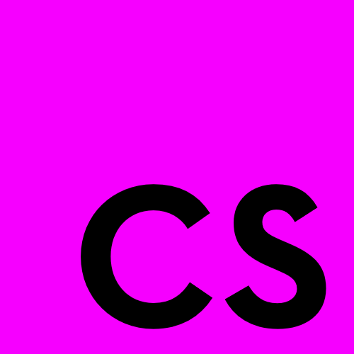

# Cleanscript

> Cleanscript is an small, indent-based language that compiles to Javascript.

- Clean, indent-based grammar.
- Compiles to Javascript for compatibility with browsers, NodeJS or Electron.
- Supports the power of Javascript promises.
- Merges familiar syntax from Python and Javascript for a clean look.
- Cleanscript still allows you to leverage all the powerful built-in Javascript libraries, objects and prototypes.

 

