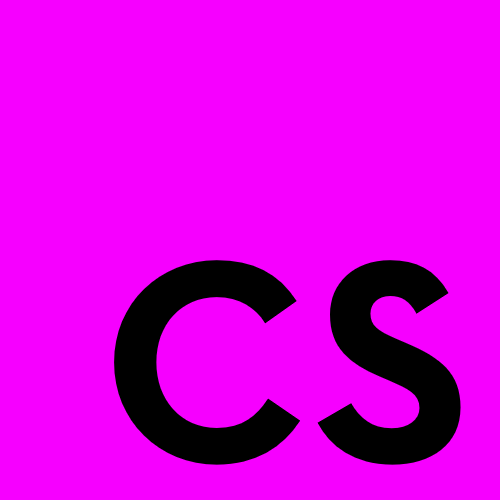

# Cleanscript

> Cleanscript is an small, indent-based language that compiles to Javascript.

- Clean, indent-based grammar.
- Useful features such as Pythonic indexes, Pythonic for loops and effortless deep equality.
- Still utilise all the powerful built-in Javascript libraries, objects and prototypes.
- Compiles to Javascript for compatibility with browsers, NodeJS and Electron.
- Mix-in Javascript at-will to access the maturity and power of pure Javascript.

[](https://npmjs.com/package/cleanscript)
[](./LICENSE)

## Table of Contents

- [Overview](#Overview)
- [Installation](#Installation)
- [Usage](#Usage)
- [Example](#Example)
- [Documentation](#Documentation)
  - [Literals](#Literals)
  - [Operators](#Operators)
  - [Variable Assignment](#Variable-Assignment)
  - [Equality](#Equality)
  - [Control Keywords](#Control-Keywords)
  - [Comments](#Comments)
  - [Indexing](#Indexing)
  - [Ternary Operators](#Ternary-Operators)
  - [If, Elif, Else](#If-Elif-Else)
  - [For Loops](#For-Loops)
  - [While Loops](#While-Loops)
  - [Do Loops](#Do-Loops)
  - [Functions](#Functions)
  - [Lambda Functions](#Lambda-Functions)
  - [Classes](#Classes)
  - [Try, Catch, Else, Finally](#Try-Catch-Else-Finally)
  - [Strict Mode](#Strict-Mode)
  - [Javascript Mix-In](#Javascript-Mix-In)

## Overview

The syntax of Cleanscript is desgined to be a blend of syntax from Javascript and Python. Cleanscript mostly functions the same as standard Javascript, still allowing access to all the standard Javascript methods, prototypes and functions, however enforces (but more importanly allows) indent-based blocks and includes some useful features not present in ES5 or ES6 Javascript. Cleanscript is intended to have a low-overhead to learn and understand for Javascript users while maintaining extra, useful features and an indent-based syntax. Cleanscript is in an immature, early state, however can compile accurate Cleanscript stabily. Any pull-requests or issues would be apppreciated.

## Installation

For global installation to compile from the command line:

```
npm i -g cleanscript
```

For programmatic compilation within projects:

```
npm i cleanscript
```

## Usage

Once installed (at least globally) you can compile a file through the command line. The path provided can be relative or absolute:

```
cleanscript ./test.drg
```

You can also compile all the `.csc` files in a folder (and its sub-folders recursively), by targeting a folder when compiling:

```
cleanscript ./
```

You can also provide the `--watch` option, which, while running, will recompile its target when changes (like a save) occur. This works with individual files and folders.

```
cleanscript ./ --watch
```

You can also provide other flags, relevant to Cleanscript through the command line:

```
--no-minify       Stops output being minified.
--no-mangle       If minifying, stops variable names from being mangled.
--prettify        Prettifies the Cleanscript output.
--no-recursion    Stops the recursive compilation of folders.
```

## Example

For example, the following Cleanscript code:

```
function checkValInVals(flag=false, *vals=[3]):
  # python style for loops
  for val in vals:
    if val == 3 and flag == true:
      return true;
  return false;

var print = lambda val : console.log(val);

try:
  print(checkValInVals()); # false
  print(checkValInVals(true)); # true
  print(checkValInVals(true, 2)); # false
  print(checkValInVals(true, 2, 3)); # true
  print(checkValInVals(false, 2, 3)); # false
catch error:
  console.error(error);
else:
  # only runs if catch doesn't
  console.log('No errors!');
```

Compiles to the following Javascript (when using the `--no-minify` and `--prettify` flags):

```js
/* Compiled by Cleanscript */

"use strict";

function $_createIterable(object) {
  if (
    object.constructor === [].constructor ||
    object.constructor === "".constructor
  ) {
    return object;
  } else if (Set && object.constructor === Set) {
    return Array.from(object);
  }
  return Object.keys(object);
}

function checkValInVals(flag = false, ...vals) {
  vals = vals.length > 0 ? vals : [3];
  var $_iterator = $_createIterable(vals);
  for (let $_forVar = 0; $_forVar < $_iterator.length; $_forVar++) {
    var val = $_iterator[$_forVar];
    if (val === 3 && flag === true) {
      return true;
    }
  }
  return false;
}

var print = function (val) {
  return console.log(val);
};

try {
  let $_successful = true;
  try {
    print(checkValInVals());
    print(checkValInVals(true));
    print(checkValInVals(true, 2));
    print(checkValInVals(true, 2, 3));
    print(checkValInVals(false, 2, 3));
  } catch (error) {
    $_successful = false;
    console.error(error);
  }
  if ($_successful) {
    console.log("No errors!");
  }
} finally {
}
```

## Documentation

### Literals

Most literals have the same familiar syntax as Javascript, apart from regular expressions which use a Pythonic syntax.

```
# numbers
1;
1.1;
1_000_000;

# strings
"a";
'a';
`a`;

# regular expressions
r"/search/g";

# arrays
[1, 2, '3'];

# dictionaries
{
  "key1": 'value1',
  "key2": 'value2'
};
```

### Operators

Cleanscript supports all the operators in Javascript (including the ES6 exponent operator `**`). Cleanscript also contains a floor division operator, `//`, which works the same as the floor division operator in Python.

```
# floor division operator
10 // 3; # equal to 3
11 // 4; # equal to 2
```

### Variable Assignment

Variable assignment works the same as Javascript, with `const`, `let` and `var` variable declarations supported as well as variable reassignments.

```
var a = "a";
const b = {};
let c = 1;
c = [1, 2, 3];
```

### Equality

Cleanscript supports deep equality checking with the operators `==` and `!=`. Deep equality checking can test whether the contents of lists, objects, sets, maps, dates and functions are the same, as well as the standard Javascript equality checking. Cleanscript is type-strict when checking equalities, using the operators `===` and `!==` respectively.

```
# standard, type-strict, equality checking
1 == 1; # true
1 == '1'; # false
1 == 2; # false
1 != 1; # false

# deep equality checking
[1, 2, 3] == [1, 2, 3]; # true
[1, 2] == [1, 2, 3]; # false
new Set([1,2]) == new Set([1,2,3]); # false
```

### Control Keywords

Cleanscript uses semantic, Pythonic, English control keywords instead of punctuation, as well as adding additional control keywords. `and` and `or` keywords are supported within Cleanscript:

```
true and true; # check if both are true
true or false; # check if at least one is true
```

Cleanscript also includes `in` and `not` control keywords. The `in` keyword checks in an element is within a target, with similar functionality to Python. The `in` keyword can check if an element is within a list, a string or an object. The `not` keyword has identical functionality to negating a statement with `!` (both are supported in Cleanscript).

```
var list = [1, 2, 3];
2 in list; # checks if 2 is in the list
```

### Comments

Cleanscript uses `#` as syntax for single-line comments and `#*` as syntax for block comments.

```
# Commented Line

#*

Commented
Out
Block

*#
```

### Indexing

Cleanscript supports advanced indexing as well as standard indexes, such as `[1:]` and `[2:3]`. These indexes have the same functionality as they would within Python.

```
var list = [1, 2, 3, 4];

console.log(list[0]); # outputs "1"
console.log(list[1:]); # outputs "[ 2, 3, 4 ]"
console.log(list[:3]); # outputs "[ 1, 2, 3 ]"
console.log(list[1:2]); # outputs "[ 2 ]"
```

These indexes can also be assigned to with the same functionality as Python. For the following examples, we will presume the `list` variable resets to `[1, 2, 3, 4]` before each index assignment.

```
list[0] = 10;                   # list becomes equal to "[ 10, 2, 3, 4 ]"
list[:2] = [100, 200];          # list becomes equal to "[ 100, 200, 3, 4 ]"
list[:2] = 50;                  # list becomes equal to "[ 50, 3, 4 ]"
list[2:] = [10, 11, 12];        # list becomes equal to "[ 1, 2, 10, 11, 12 ]"
list[1:2] = [10, 11];           # list becomes equal to "[ 1, 10, 11, 3, 4 ]"
```

### Ternary Operators

Ternary operators in Cleanscript use the keywords `then` and `else` instead of `?` and `:` respectively. The ternary statement doesn't need to contain an else branch, and if no else branch is supplied, the compiled else branch of the ternary statement will have a value of `undefined`.

```
var a = 1 == 1 then 'yes' else 'no';
console.log(a == 'yes' then 'correct' else 'incorrect');

var b = 1 == 2 then 'yes'; # value will be undefined
```

### If, Elif, Else

If, elif and else statements work similarly to Javascript, with minor differences in syntax. In Cleanscript, the else if keyword is `elif` not `else if`. The if and elif conditions don't need to be surrounded by parentheses.

```
if a == 1:
  console.log("Option 1");
elif a == 2:
  console.log("Option 2");
else:
  console.log("No Option");
```

### For Loops

Cleanscript implements Pythonic for loops. For loops can iterate over lists, sets, objects and strings.

```
var names = ["jeff", "tom", "john"];
for name in names:
  console.log(`I am friends with ${name}`);
```

If you want to iterate over indexes of a list or a list of numbers, the `range(start, end, step)` function is included to help. The `range()` function has the same functionality as the Python `range()` function:

```
var names = ["jeff", "tom", "john"];
for i in range(0, names.length):
  console.log(names[i]);

range(0, 10, 2); # generates list "[ 0, 2, 4, 6, 8 ]"
```

### While Loops

Cleanscript while loops are the same as plain Javascript, but use an indent-based syntax and do not require parentheses around the condition.

```
while true:
  console.log('a');
  console.log('b');
```

### Do Loops

Cleanscript also supports do-while loops.

```
do:
  console.log('a');
while true;
```

Cleanscript doesn't require a while condition, and if no while condition is provided, the do block is only ran once.

```
do:
  console.log('a');
```

### Functions

Functions can be declared as regular functions, asynchronous functions or generators.

```
# no parameters
function main:
  console.log('function main');

# asynchronous function
async function nonSyncFunction:
  return;

# generator
function* generatorFunction:
  yield 1;
```

Functions can contain an unlimited number of parameters. Wildcard parameters are also supported, but must be the last parameter of the function.

```
# three parameters
function main(a, b, c):
  console.log(a);
  console.log(b);
  console.log(c);

# one parameter and a wildcard parameter
function wildcard(a, *b):
  console.log(a);
  console.log(b);
```

Both standard and wildcard parameters can have a default value, which will replace the parameters value if no value is provided for it in the function call.

```
# two parameters with default values
function main(a=1, b=2):
  console.log(a);
  console.log(b);

# a wildcard parameter with a default value
function wildcard(*a=[1,2,3]):
  console.log(a);
```

Cleanscript also has a feature for casting parameters to functions before the main body of the function. This is useful for performing operations on a parameter before the function, such as converting the type of the parameter. The name of provided function before the `->` statement is the name of the function that will be called with the parameter, and the returned value will be reassigned as the parameter variables value.

```
var timesTwo = lambda x : x * 2;

# call the timesTwo function with a and reassign a as the returned value
function print(timesTwo -> a):
  console.log(a);
```

### Lambda Functions

Lambda functions are a clean, expressive way to create one-line functions with implicit returns. Lambda functions can have an unlimited amount of arguments or no arguments, however can only contain a one-line body. Lambda functions can be synchronous or asynchronous.

```
# lambda functions with no arguments
var randomUpto10 = lambda : Math.floor(Math.random() * 10);

# lambda functions with parameters
var double = lambda x : x * 2;
var getIndex = lambda x, *y: y[x];

# async lambda function with default parameter
var asyncLambda = async lambda x=2 : x ** 3;
```

### Classes

In cleanscript, you can declare a class like the following. The class' methods use the same syntax as regular functions, and have all the same features. The method with the name `constructor` will be used as the class' constructor, same as regular Javascript.

```
class Test:
  # synchronous method
  function constructor:
    this.name = "tom";

  # asynchronous method
  async function sayYourName:
    console.log(this.name);
```

In Cleanscript, you can define class inheritance with similar syntax to Python's inheritance:

```
class Test(Main):
  function constructor:
    this.name = "tom";
```

### Try, Catch, Else, Finally

Cleanscript supports try, catch, else and finally branches. The else branch is only executed if catch is not executed. All other branches function the same as vanilla Javascript. Try statements in Cleanscript don't require a catch or finally block afterwards.

```
try:
  console.log('Trying...');
catch:
  console.error("An error occurred.");
else:
  # only run if catch isn't
  console.log("No catch required.");
finally:
  console.log('All Finished');
```

If you want to specify the error parameter for the catch block, you can do so like:

```
catch errorVar:
  console.error(errorVar);
```

### Strict Mode

Cleanscript by default enables strict mode. Strict mode helps to encourage better code and prevents common issues in the code. If you don't want strict mode, you can disable it explicitly by putting the statement `"unstrict";` before any other statement in your program, like so:

```
"unstrict";

# program contents
```

### Javascript Mix-in

In Cleanscript you can mix-in Javascript anywhere a statement (such as an if statement or a variable declaration) could also be placed. You can mix-in Javascript by using the `JSRAW` keyword and a string containing the Javascript you want to mix-in, such as:

```
JSRAW "

a+b;

";
```

## Credit

Author: [Tom](https://github.com/TomPrograms)

## License

[MIT](LICENSE)
